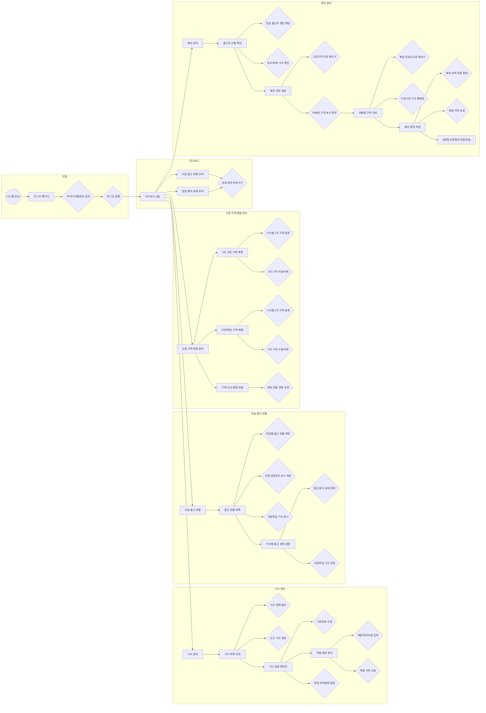

```mermaid
flowchart LR

  subgraph s1 ["인증"]
    n1(("시스템 진입"))
    n2["로그인 페이지"]
    n3{"아이디/비밀번호 입력"}
    n4{"로그인 실행"}
  end

  subgraph s2 ["대시보드"]
    n5["대시보드 (홈)"]
    n6["오늘 출근 현황 요약"]
    n7["일일 배차 상태 요약"]
    n8{"상세 화면 바로가기"}
  end

  subgraph s3 ["기사 관리"]
    n9["기사 관리"]
    n10["기사 목록 조회"]
    n11{"기사 검색/필터"}
    n12{"신규 기사 등록"}
    n13["기사 상세 페이지"]
    n14{"기본정보 수정"}
    n15["역량 메모 관리"]
    n16{"역량/특이사항 입력"}
    n17{"역량 이력 조회"}
    n18{"최대 처리물량 설정"}
  end

  subgraph s4 ["고정 구역 매핑 관리"]
    n19["고정 구역 매핑 관리"]
    n20["1차 고정 구역 매핑"]
    n21{"기사별 1차 구역 등록"}
    n22{"1차 구역 수정/삭제"}
    n23["2차(백업) 구역 매핑"]
    n24{"기사별 2차 구역 등록"}
    n25{"2차 구역 수정/삭제"}
    n26["구역-기사 매핑 현황"]
    n27{"매핑 현황 전체 조회"}
  end

  subgraph s5 ["오늘 출근 현황"]
    n28["오늘 출근 현황"]
    n29["출근 현황 목록"]
    n30{"타임별 출근 현황 확인"}
    n31{"무휴/단일휴무 표시 확인"}
    n32{"지원투입 기사 표시"}
    n33["기사별 출근 상태 설정"]
    n34{"출근/휴무 상태 변경"}
    n35{"지원투입 기사 지정"}
  end

  subgraph s6 ["배차 관리"]
    n36["배차 관리"]
    n37["출근자 산출 확인"]
    n38{"당일 출근자 명단 확인"}
    n39{"휴무/부재 기사 확인"}
    n40["배차 초안 생성"]
    n41{"고정구역 자동 채우기"}
    n42{"미배정 구역 표시 확인"}
    n43["미배정 구역 처리"]
    n44{"백업 후보군으로 채우기"}
    n45{"드래그로 기사 재배정"}
    n46["배차 확정 저장"]
    n47{"배차 내역 최종 확정"}
    n48{"확정 이력 조회"}
    n49["[제외] 마켓컬리 연동/전송"]
  end

  n1 --> n2
  n2 --> n3
  n3 --> n4
  n4 --> n5
  n5 --> n6
  n5 --> n7
  n6 --> n8
  n7 --> n8
  n5 --> n9
  n9 --> n10
  n10 --> n11
  n10 --> n12
  n10 --> n13
  n13 --> n14
  n13 --> n15
  n15 --> n16
  n15 --> n17
  n13 --> n18
  n5 --> n19
  n19 --> n20
  n20 --> n21
  n20 --> n22
  n19 --> n23
  n23 --> n24
  n23 --> n25
  n19 --> n26
  n26 --> n27
  n5 --> n28
  n28 --> n29
  n29 --> n30
  n29 --> n31
  n29 --> n32
  n29 --> n33
  n33 --> n34
  n33 --> n35
  n5 --> n36
  n36 --> n37
  n37 --> n38
  n37 --> n39
  n37 --> n40
  n40 --> n41
  n40 --> n42
  n42 --> n43
  n43 --> n44
  n43 --> n45
  n43 --> n46
  n46 --> n47
  n46 --> n48
  n46 --> n49
```
